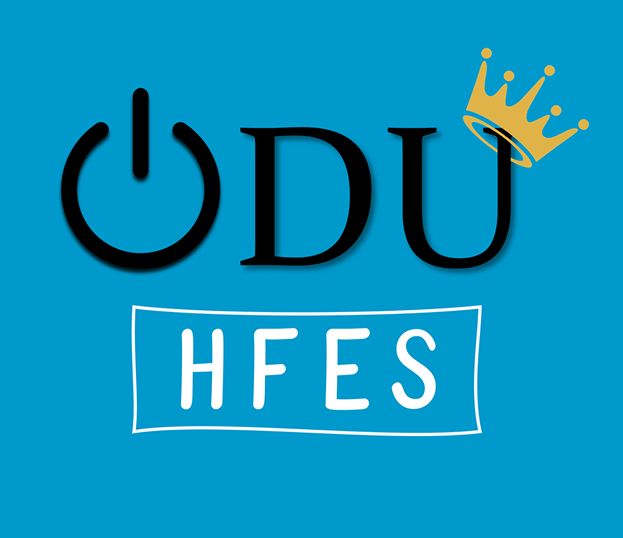

<!-- Main -->

<!-- One -->
<!--<section id="one">
	

		<!--<header class="major">
			<h2></h2>
		</header>-->
		
Here are a few of my most recent hands-on projects.

	<!--

</section>-->

<!-- Two -->
<section id="two" class="spotlights">
	<section>
		
		

			

				<header class="major">
					<h3>Flakr</h3>
				</header>
				
In our increasingly digital world, flaky people have it made. It’s easier than ever to play “yes man” now and bow out later. Why? Because there are no consequences. We can make plans now with the best of intentions and cancel them later in a matter of nonconfrontational keystrokes. Busy people can’t seem to make plans; flaky people can’t seem to keep them.    This realization is what inspired my idea for the Flakr app. From a low-fidelity paper prototype, I ended up with an Adobe XD to create a wireframe. I knew this would primarily be an event app, but with one novel twist: along with the date, time and location, users would be able to set a $1-$5 flaker’s fee for those who RSVP “yes” and end up as no-shows. Those who follow through, of course, would not be charged – but they would be entered to win the flaker’s fees, or Flakr pool.

				<!--<ul class="actions">
					<li><a href="generic.html" class="button">Learn more</a></li>
				</ul>-->
			

		

	</section>
	<section>
		
		

			

				<header class="major">
					<h3>Use Your Illusion</h3>
				</header>
				
In terms of login speed, Use Your Illusion (first developed by Hayashi et al., 2008), is an especially promising scheme for graphical authentication. The user is assigned a passcode of three images, whose quality is then degraded to prevent over-the-shoulder attacks. To authenticate, the user must select his or her passcode images from a grid of distractor images, which are also degraded. However, Tiller et al. (2018) suggest  that the current level of image degradation may be too great for users to remember. Following their <a href="https://link.springer.com/chapter/10.1007/978-3-319-94782-2_9">design recommendations</a>, I developed my own version of a UYI-based login using Pexels open-source images, GIMP graphics editor, and Paradigm research software.

			

		

	</section>
	<section>
		
		

			

				<header class="major">
					<h3>ODU HFES Logo Design</h3>
				</header>
				
In my free time, I volunteer as webmaster for the Human Factors and Ergonomics Society student chapter at Old Dominion University. This year, I was also proud to win the logo redesign contest. I thought to myself that our original logo needed some more modern, eye-grabbing rework, so I came up with a variety of designs. This is the one that stuck!

			

		

	</section>
</section>

<!-- Three -->
<!--<section id="three">
	

		<header class="major">
			<h2>Massa libero</h2>
		</header>
		
Nullam et orci eu lorem consequat tincidunt vivamus et sagittis libero. Mauris aliquet magna magna sed nunc rhoncus pharetra. Pellentesque condimentum sem. In efficitur ligula tate urna. Maecenas laoreet massa vel lacinia pellentesque lorem ipsum dolor. Nullam et orci eu lorem consequat tincidunt. Vivamus et sagittis libero. Mauris aliquet magna magna sed nunc rhoncus amet pharetra et feugiat tempus.

		<ul class="actions">
			<li><a href="generic.html" class="button next">Get Started</a></li>
		</ul>
	

</section>-->

